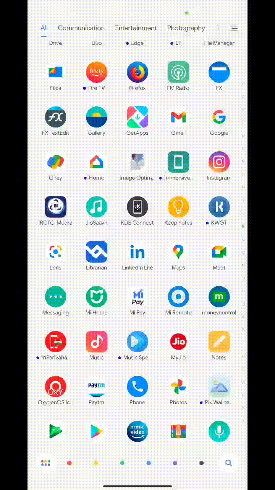
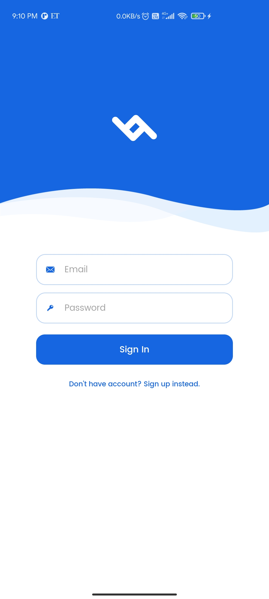
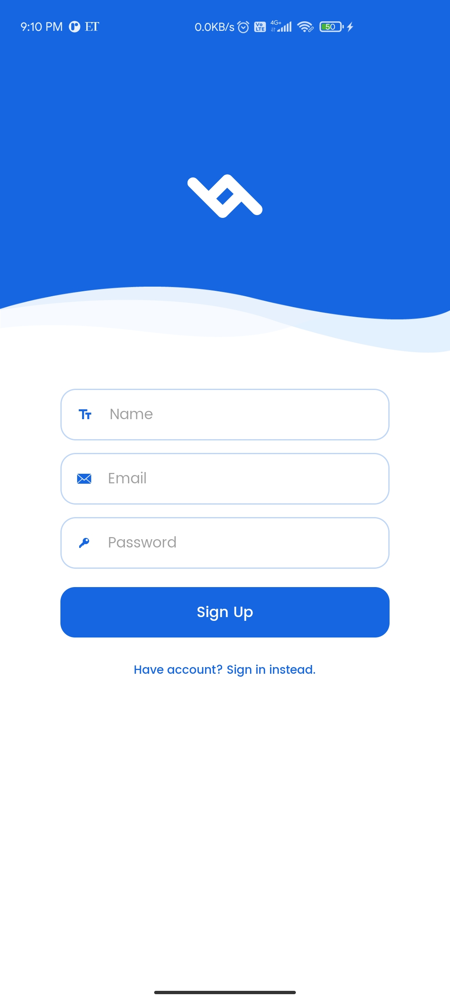
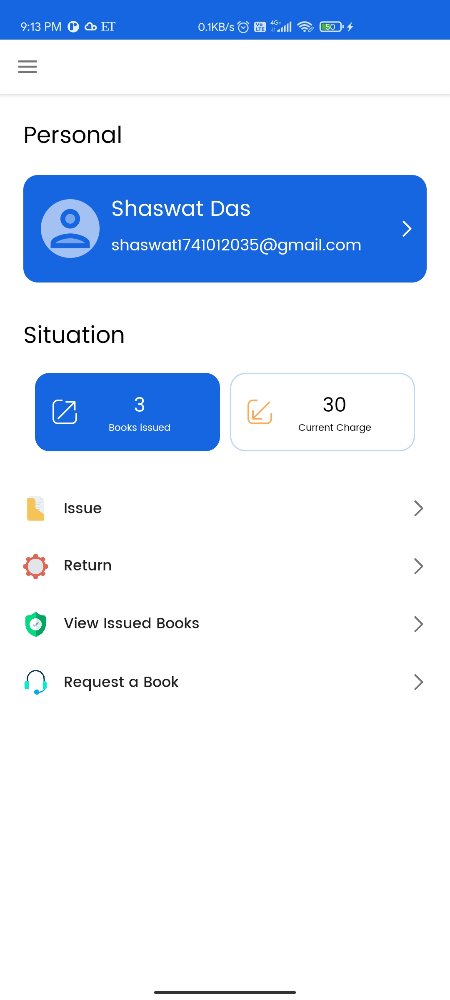
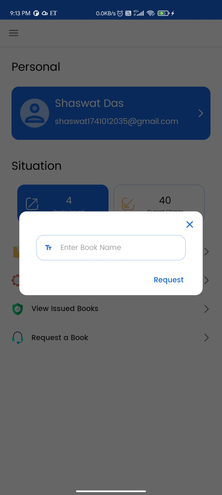
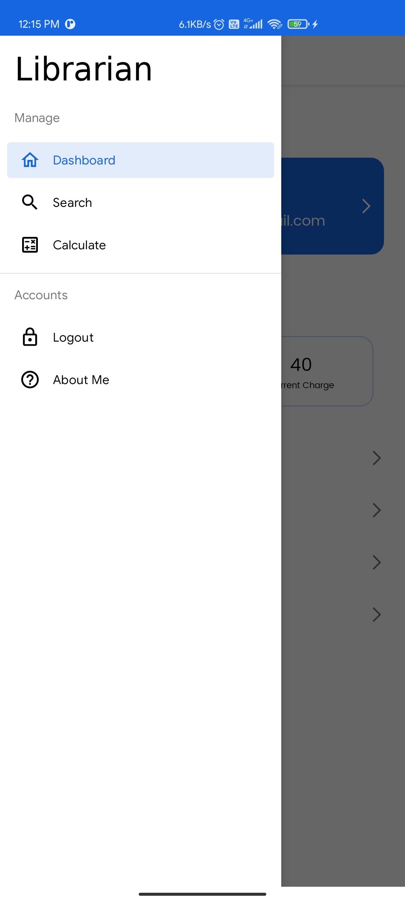
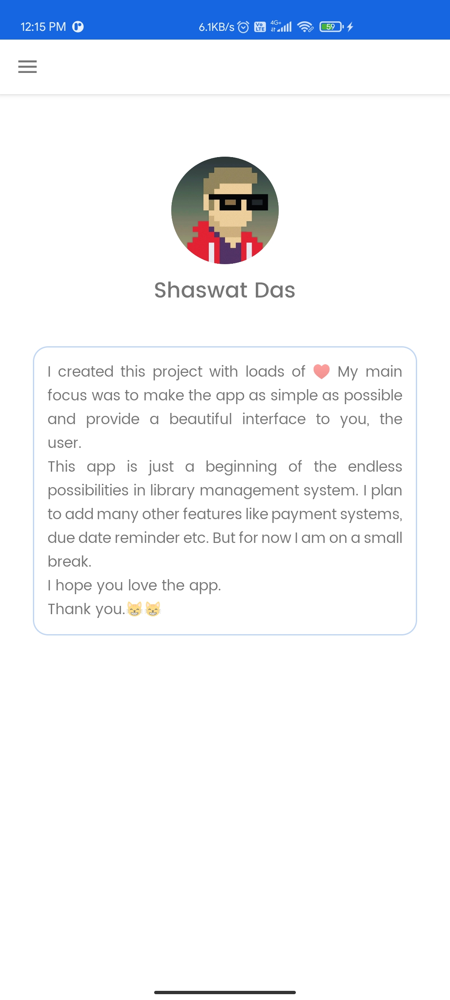
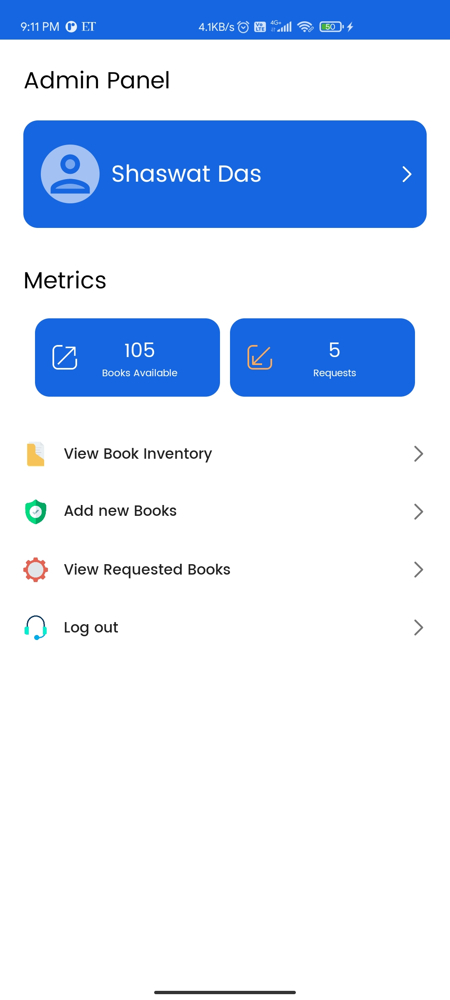
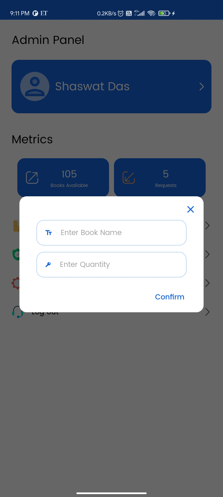

# Librarian - Library Management System
Librarian is a full fledged library management system that includes an user panel and an admin panel
## User Panel
* Create and Log in to account
* Homescreen containing realtime information about books issued and current issue charge
* Issue books, view issued books and return books
* Request a book
* Search book info
* Book issue charge calculator
## Admin Panel
* Homescreen containing realtime information about books available and number of requested books
* View book inventory and add new books
* View requested books
## Future scope
* Add new features like reset password, book return date reminder
* Add Payment System
* Implement Dark Mode 😉
## Screenshots

### Login Screen

  

### User Panel

  

  

### Admin Panel

 

